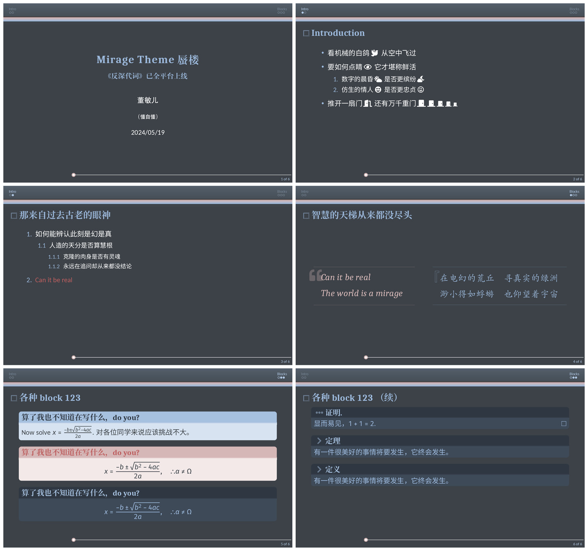
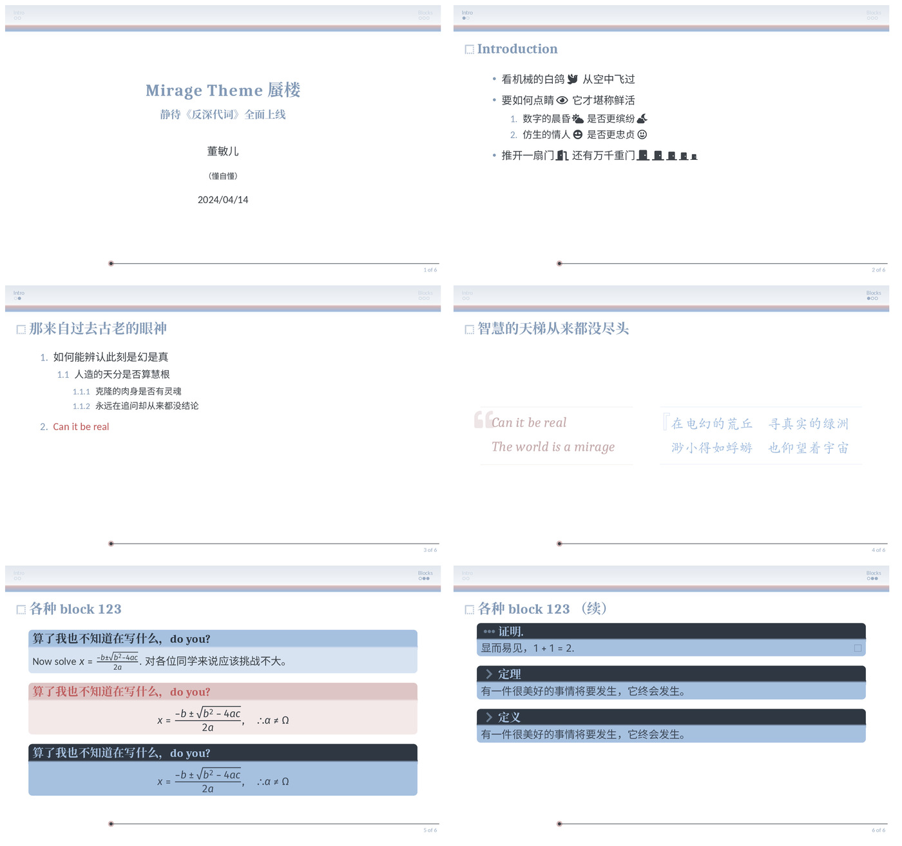

# "Mirage" “蜃楼” beamer theme

A beamer theme inspired by Zhou Shen's [`Mirage' song  poster](https://y.qq.com/music/photo_new/T002R800x800M000001D1RVa1THf8K.jpg).
基于周深《反深代词》先行曲[《蜃楼》歌曲海报](https://y.qq.com/music/photo_new/T002R800x800M000001D1RVa1THf8K.jpg)的beamer主题。

以前也做过基于周深在流淌的歌声里[（近乎）清唱《青花瓷》](https://www.bilibili.com/bangumi/play/ep332561)印象的[beamer主题“天青色”](https://github.com/liantze/pgfornament-han/blob/master/beamerthemeTianQing.sty)，这次是基于《蜃楼》主题海报的色调，简单地试做了一个版本。

Compile with XeLaTeX or LuaLaTeX. You may need to compile twice for the total number of frames in the footer to come out correctly.

请用 XeLaTeX 或 LuaLaTeX 编译。

## Default and `light` mode
The default has a dark look: 默认模式是dark:

```latex
\usetheme{Mirage}
```




There's a `light` mode too, handy if you want to print things out: 也有 `light` 模式，比较适合列印，省墨水：

```latex
\usetheme[light]{Mirage}
```




## Some simple customisation options 可供调整的元素

- I've loaded the `caladea`, `carlito` font packages and set Fira Math as the math font in `main.tex`. You can change these to fit your own preferences.
- `pullquote` is a custom environment; you can change the `beamer font` and `beamer color`, and `\renewcommand` the `\MiragePullquoteOpen` marker (see frame 4).
- Other markers that can be `\renewcommand`: `\MirageFrametitlePrefix`, `\MirageProofPrefix`
and `\MirageTheoremPrefix` for prefix icons of the frame title, `proof` block title and `theorem`-like block titles. (See commented code before slide 5.)

`beamerthemeMirage` loads `fontawesome5` so you can use icons provided by this package.